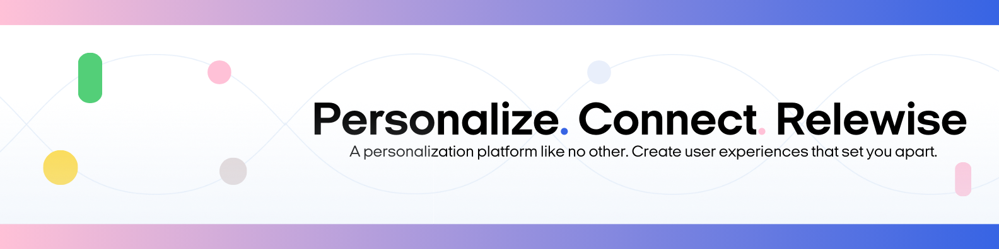

  

---
# Relewise UI Components
Components for building an awesome UI with Relewise. 

## Packages

| Package | Version | Description |
| --- | --- | --- |
| [`@relewise/web-components`](packages/web-components) |  | Relewise Web Components are reusable, self-contained html extensions for Relewise. 

## Contributing

Pull requests are always welcome.  
Please fork this repository and make a PR when you are ready with your contribution.  

Otherwise you are welcome to open an Issue in our [issue tracker](https://github.com/Relewise/relewise-ui-components/issues).

## License

relewise-ui-components is licensed under the [MIT license](./LICENSE).
